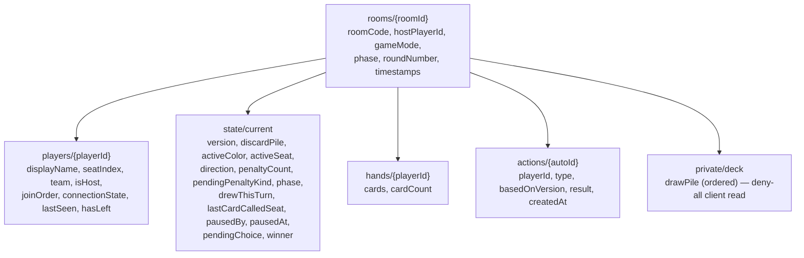
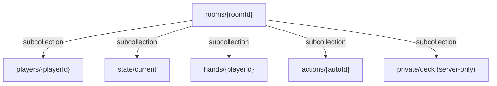
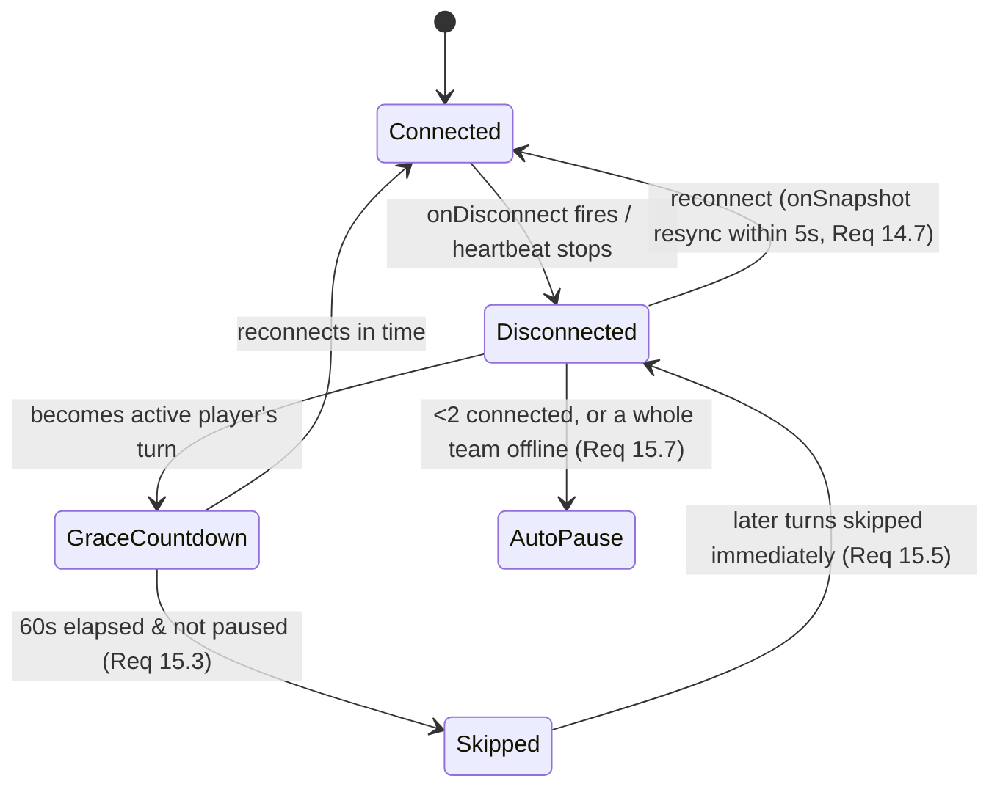
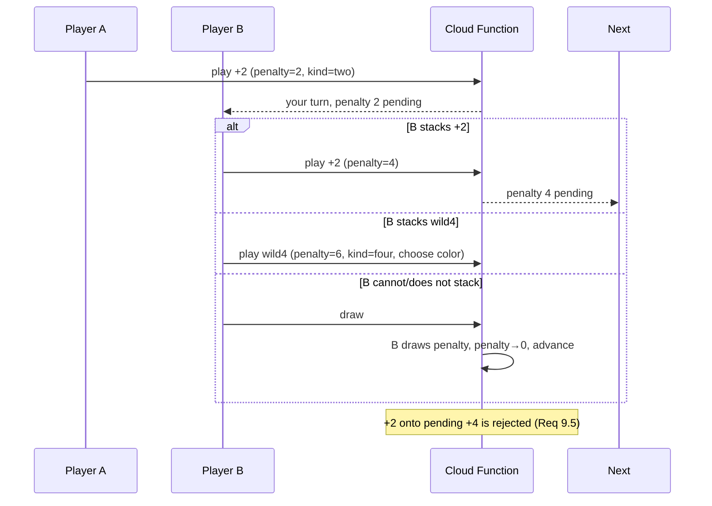
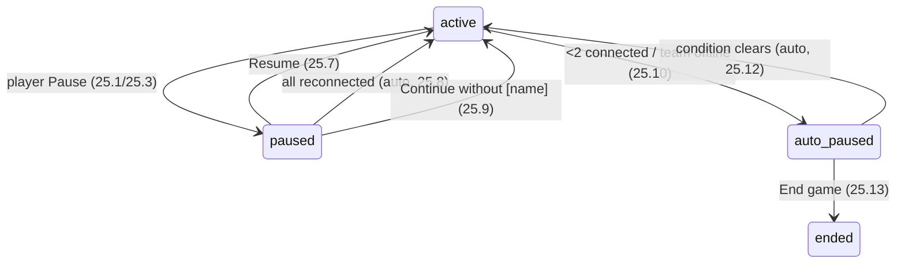

# Design Document: Homemade Uno

## Overview

Homemade Uno is a mobile-only, portrait, link-shareable multiplayer UNO-style card game delivered as an installable PWA. Players create a private room, share an invite link (or a 4-character room code), and play a standard 108-card match with 2–8 friends. There are no accounts and no bots. The host picks the mode in the lobby: Normal (free-for-all, 2–8 players) or 2v2 Team mode (exactly 4 players, partners see each other's hands, a team wins when either partner empties their hand).

The system is **server-authoritative**. A Firebase backend deals, shuffles, and validates every action; clients only render state and send action requests. Game logic runs inside Cloud Functions (which use the Admin SDK to bypass Security Rules), and clients read state through Cloud Firestore realtime listeners constrained by Firestore Security Rules. This is the load-bearing decision for the whole design because three requirements depend on it:

- **Requirement 23 (Hidden Hands and Server Authority)** — the server, not the client, holds the deck order and every hand. Clients never receive another player's hand (except a partner's in Team mode) or the draw-pile order.
- **Requirement 14 (Realtime Synchronization)** — the server persists authoritative state before confirming a change, validates every play/draw, versions each state transition, and rejects out-of-turn or stale actions.
- **Requirement 25 / 15 (Pausing, Disconnect)** — pause/resume and the disconnect grace period are enforced server-side against a recorded `lastSeen`, so no client can fake presence or skip the countdown.

The rest of the design is organized around that spine:

| Area                                                                | Requirements covered        |
| ------------------------------------------------------------------- | --------------------------- |
| Rooms, codes, invite links, join/rejoin                             | 1, 2, 3, 24                 |
| Lobby, mode selection, team arrangement                             | 4, 21                       |
| Dealing, turn flow, matching, wilds, stacking, draw, last-card, win | 5, 6, 7, 8, 9, 10, 11, 12   |
| Team visibility                                                     | 13                          |
| Realtime, disconnect/reconnect, hidden hands                        | 14, 15, 23                  |
| Pausing (manual and auto)                                           | 25                          |
| PWA / mobile constraints, animation, accessibility                  | 16, 17, 18                  |
| Screen coverage and design fidelity                                 | 19, 20, Development Process |
| Leaving                                                             | 22                          |

Every visual decision in this document is grounded in the `Design_Spec` (`design/uno-design/design.md`, `screen-map.json`, `theme.css`, `tokens.json`, `screens/`). No new tokens or visual values are introduced (Requirement 20).

### Confirmed technology stack

- **Frontend:** React + Vite, Tailwind CSS v4, Motion for React (`motion/react`) for animation. Mobile-only, portrait, installable PWA (manifest + service worker).
- **Backend / realtime / data:** Firebase — Cloud Firestore for state and live sync (realtime via `onSnapshot`), Cloud Functions (callable, Admin SDK) for server-authoritative game logic, Firebase Anonymous Auth for `Player_ID`, and Firestore Security Rules to enforce hidden hands. Local development runs against the Firebase Emulator Suite.
- **Identity:** a Firebase Anonymous Auth session is the `Player_ID`. Rejoin uses the invite link plus the persisted session.
- No bots. No per-turn timer for connected players. A 60-second `Grace_Period` applies to a disconnected active player, then their turn is auto-skipped. Pause / Auto_Pause per Requirement 25.

_Note: the pure rules engine (`src/game/engine`) is backend-agnostic and unchanged; only its server wrapper (now a Cloud Function) and the persistence/realtime layer are Firebase-specific._

---

## Architecture

### System context

```mermaid
graph TB
  subgraph Client["React PWA (mobile, portrait)"]
    UI["Screens & components<br/>(22 screen refs)"]
    RS["onSnapshot store<br/>(public state + own hand)"]
    AC["Action client<br/>(callAction → httpsCallable)"]
    SW["Service worker + manifest"]
  end

  subgraph Firebase["Firebase"]
    AUTH["Anonymous Auth<br/>(Player_ID)"]
    FS[("Cloud Firestore<br/>rooms, players, state,<br/>hands, actions, private deck")]
    RULES["Firestore Security Rules<br/>(hidden hands, read scope)"]
    FN["Cloud Functions (callable, Admin SDK)<br/>(authoritative rules engine)"]
  end

  UI --> RS
  UI --> AC
  AC -->|"play/draw/pause… + basedOnVersion"| FN
  FN -->|deal, shuffle, validate, mutate<br/>(transaction, Admin SDK)| FS
  FS --- RULES
  FS -->|"onSnapshot doc/collection updates"| RS
  AUTH -->|session = Player_ID| Client
  RULES -.->|filters client reads| RS
```

### Why game logic lives server-side

A browser client cannot be trusted with the deck order or other players' hands: anything sent to the client can be inspected in network traffic (Requirement 23). Therefore:

1. **The rules engine runs only in Cloud Functions.** Dealing, shuffling, match validation, penalty resolution, and win detection all execute server-side inside callable Cloud Functions (using the Admin SDK). The client sends an _intent_ ("play card X, based on state version V") and receives an accept/reject result; the new public state is delivered to all clients via Firestore `onSnapshot` listeners.
2. **Firestore Security Rules enforce read scope.** A client can read only its own hand document, the public game state, the public room/players documents, and — in Team mode — its partner's hand document. No rule grants any client read access to the private deck (draw-pile order).
3. **Persist-before-confirm.** The Cloud Function commits the mutated authoritative state to Firestore inside a single transaction before returning its accept result, so the state survives any individual disconnect (Requirement 14.4).

### Request / response + realtime flow for "play a card"

```mermaid
sequenceDiagram
  participant P as Player (Active)
  participant FN as Cloud Function<br/>playCard(room, card, basedOnVersion)
  participant FS as Cloud Firestore (Admin SDK)
  participant RULES as Security Rules
  participant All as All players in room

  P->>FN: httpsCallable playCard(cardId, basedOnVersion=V)
  FN->>FS: transaction: read state doc (rooms/{id}/state/current)
  alt version mismatch, paused, not active player, or illegal card
    FN-->>P: reject (reason code)
    Note over P: client shows illegal-tap shake / toast,<br/>hand & state unchanged (Req 7.3, 14.5)
  else valid
    FN->>FS: apply engine (move card, set color,<br/>penalty, advance turn); write state + hand docs;<br/>version = V+1; commit transaction
    FS-->>FN: committed
    FN-->>P: accept (result)
    FS-->>All: onSnapshot updates (state, players, own/partner hand)
    Note over All,RULES: Security Rules filter reads;<br/>public state < 2s (Req 14.1)
  end
```

The client is optimistic only for local feedback (raising a card, drawing animation); the authoritative outcome always comes from the Firestore `onSnapshot` update. If the Cloud Function rejects, the client reverts to the last confirmed state.

### How server-authority + Security Rules satisfy Requirements 23 and 14

- **Req 23.1 / 23.2 (never send other hands or draw order):** The `hands` subcollection holds one document per player per game; Security Rules restrict reads to `playerId == request.auth.uid` plus the partner in Team mode. The draw-pile order lives in a server-only location (`rooms/{roomId}/private/deck`) with a **deny-all** read rule — only Cloud Functions (Admin SDK) read it.
- **Req 23.3 (server deals, shuffles, applies rules):** All mutations flow through Cloud Functions (Admin SDK); there is no client write path to the state, hands, or private deck documents.
- **Req 14.5 (validate every action, reject non-active and stale):** Each action carries `basedOnVersion`; the Cloud Function's Firestore transaction rejects if the caller is not the active player or if `basedOnVersion != state.version`.
- **Req 14.6 (read scope):** Enforced by the same Firestore Security Rules described above.
- **Req 14.4 / 14.7 (durability and reconnect):** State is committed per action; on reconnect the client re-attaches its `onSnapshot` listeners and receives the current public state and its own hand (delivered within 5 s).

---

## Data Models

Cloud Firestore document model. All game-mutating writes happen through Cloud Functions using the Admin SDK (which bypasses Security Rules); clients read documents through Security-Rules-protected listeners and never write game documents directly. The data is organized as a room-rooted collection/subcollection tree.

### Firestore tree



### Documents

**`rooms/{roomId}`**

| Field                          | Type      | Notes                                                                                |
| ------------------------------ | --------- | ------------------------------------------------------------------------------------ |
| `roomCode`                     | string    | 4 chars, A–Z/0–9 minus look-alikes `0 O 1 I L` (Req 1.9), unique across active rooms |
| `hostPlayerId`                 | string    | current host (Req 3.6, 12.7, 15.8)                                                   |
| `gameMode`                     | string    | `normal` \| `team` (Req 4)                                                           |
| `phase`                        | string    | `lobby` \| `playing` \| `ended`                                                      |
| `roundNumber`                  | number    | games played in the room; shown as "Round N" (Req 12.6)                              |
| `createdAt` / `lastActivityAt` | timestamp | 24 h inactivity cleanup (Req 24.2)                                                   |

**`rooms/{roomId}/players/{playerId}`** (a seat/membership in a room; the document id is the `Player_ID`, so `(roomId, playerId)` uniqueness is inherent)

| Field             | Type           | Notes                                                                                 |
| ----------------- | -------------- | ------------------------------------------------------------------------------------- |
| `displayName`     | string         | 1–16 chars trimmed; duplicate suffixing applied (Req 1.12, 1.13)                      |
| `seatIndex`       | number \| null | assigned at game start, kept for the game (Req 5.7)                                   |
| `team`            | string \| null | `A` \| `B` in Team mode (Req 5.7)                                                     |
| `isHost`          | boolean        | derived from `rooms.hostPlayerId`; retained per seat while host is offline (Req 15.8) |
| `joinOrder`       | number         | for host succession "longest-present" (Req 3.6, 12.7)                                 |
| `connectionState` | string         | `connected` \| `disconnected` \| `left` (Req 15, 22)                                  |
| `lastSeen`        | timestamp      | server-recorded; drives Grace_Period (Req 15.6)                                       |
| `hasLeft`         | boolean        | explicit leave (Req 22)                                                               |

The document id equals the player's Firebase Anonymous Auth `uid` (Req 3.1).

**`rooms/{roomId}/state/current`** (one public state document per room while playing)

| Field                | Type              | Notes                                                                                              |
| -------------------- | ----------------- | -------------------------------------------------------------------------------------------------- |
| `version`            | number            | optimistic-concurrency token; incremented every mutation (Req 14.5)                                |
| `discardPile`        | array (ordered)   | public; top card is the match constraint                                                           |
| `activeColor`        | string            | red/yellow/green/blue (Req 7, 8)                                                                   |
| `activeSeat`         | number            | exactly one active player (Req 6)                                                                  |
| `direction`          | number            | `+1` clockwise / `-1` counter-clockwise (Req 6)                                                    |
| `penaltyCount`       | number            | pending +2/+4 total (Req 9)                                                                        |
| `pendingPenaltyKind` | string \| null    | `two` \| `four` — governs stacking eligibility (Req 9.5)                                           |
| `phase`              | string            | `dealing` \| `active` \| `wild_pending` \| `drew_decision` \| `paused` \| `auto_paused` \| `ended` |
| `drewThisTurn`       | boolean           | one draw per turn (Req 10.3)                                                                       |
| `lastCardCalledSeat` | number \| null    | current turn's Last_Card_Call (Req 11)                                                             |
| `pausedBy`           | string \| null    | who paused (Req 25.4)                                                                              |
| `pausedAt`           | timestamp \| null | drives "Paused for m:ss" (Req 25)                                                                  |
| `pendingChoice`      | map \| null       | wild-color or play/keep choice to re-show after resume (Req 25.14)                                 |
| `winner`             | map \| null       | winning player or team (Req 12)                                                                    |

**The draw-pile order is NOT stored in this client-readable document.** It lives in `rooms/{roomId}/private/deck` (see below) so no client can read draw order (Req 23.2).

**`rooms/{roomId}/private/deck`** (server-only; deny-all client read)

| Field      | Type            | Notes                                                                  |
| ---------- | --------------- | ---------------------------------------------------------------------- |
| `drawPile` | array (ordered) | face-down draw-pile order; readable only by Cloud Functions (Req 23.2) |

**`rooms/{roomId}/hands/{playerId}`** (one document per player per game; document id is the `Player_ID`)

| Field       | Type            | Notes                                       |
| ----------- | --------------- | ------------------------------------------- |
| `cards`     | array (ordered) | the player's cards                          |
| `cardCount` | number          | denormalized for opponent badges (Req 13.5) |

**`rooms/{roomId}/actions/{autoId}`** (append-only event log; concurrency + audit + reconnect replay; `autoId` is a Firestore auto-generated id)

| Field            | Type      | Notes                                                                                                                                       |
| ---------------- | --------- | ------------------------------------------------------------------------------------------------------------------------------------------- |
| `playerId`       | string    | actor                                                                                                                                       |
| `type`           | string    | `play` \| `draw` \| `keep` \| `choose_color` \| `call_last` \| `pause` \| `resume` \| `continue_without` \| `end_game` \| `join` \| `leave` |
| `basedOnVersion` | number    | version the client acted on (Req 14.5)                                                                                                      |
| `result`         | string    | `accepted` \| `rejected` + reason                                                                                                           |
| `createdAt`      | timestamp |                                                                                                                                             |

The append-only log lets a reconnecting client confirm it is on the latest version and supports server-side conflict rejection: an action whose `basedOnVersion` is not the current `state/current.version` is rejected as stale by the Cloud Function transaction.

### Card representation

A card is `{ id, suit?, value }` where `suit ∈ {red,yellow,green,blue}` (absent for wilds) and `value ∈ {0..9, +2, skip, reverse, wild, wild4}`. `id` is a stable identifier used for the shared-layout play animation (`layoutId`, Req 17.1).

### Firestore Security Rules (read/write scope)

- **`state/current`:** readable by any authenticated member of the room (public game state). The draw-pile order is not in this document, so nothing secret is exposed (Req 23.2).
- **`hands/{playerId}`:** read allowed when `playerId == request.auth.uid`; additionally, in Team mode, when the requesting player and the target player share the same `team` in the same room (partner readability, Req 13.8, 14.6). No cross-team, non-self reads (Req 23.1).
- **`private/deck`:** **deny all client reads** — only Cloud Functions (Admin SDK) read it (Req 23.2).
- **`players`, `rooms`:** publicly readable within the room (names, connection state, mode, code) — no hand data.
- **Player presence write:** a player may write **only** their own `lastSeen`/presence field on their own `players/{playerId}` document (narrow allow rule); all other player fields are server-written.
- **All game writes:** performed only by Cloud Functions via the Admin SDK, which bypasses Security Rules. There is **no** client write rule for `state/current`, `hands`, `private/deck`, or the `actions` log; those writes are denied to clients.



---

## Game Engine / Rules

The rules engine is a pure module (`src/game/engine`) that takes an authoritative state plus an action and returns either a new state or a rejection. It is backend-agnostic and unchanged by the move to Firebase: it is invoked server-side by a Cloud Function wrapper and is the core correctness surface. Keeping it pure (no I/O, deterministic given an injected RNG seed) is what makes the property-based tests in the Testing Strategy possible.

### Deck composition and shuffle (Req 5.1, 5.2)

- Build the **108-card deck**: per suit — one `0`, two each of `1`–`9`, two `+2`, two `skip`, two `reverse`; plus 4 `wild` and 4 `wild4`. Total = 4×(1 + 18 + 2 + 2 + 2) + 8 = 4×25 + 8 = 108.
- Shuffle with a server-side CSPRNG (Fisher–Yates). The seed/order never leaves the server.

### Deal (Req 5.2–5.7)

- Deal exactly 7 cards to each player, one at a time, round-robin by seat, from the shuffled draw pile.
- Turn the top card face-up as the initial discard; set `active_color` to its suit. If it is **not** a number card, return it, reshuffle, and turn another until a number card is on top (Req 5.5).
- First active player = host; `direction = +1` (clockwise) (Req 5.6).
- Team mode: assign seats alternating Team A / Team B so partners sit opposite (Req 5.7).

### Turn advancement (Req 6)

- After a legal play or resolved draw, advance `active_seat` by `direction` to the next occupied seat.
- **Reverse:** 3+ players → invert `direction` (Req 6.2). Exactly 2 players → direction unchanged, opponent skipped, same player acts again (Req 6.3).
- **Skip:** 3+ players → advance past the next player (Req 6.4). Exactly 2 players → same player acts again (Req 6.5).
- A connected active player has no time limit (Req 6.8). A non-active player's play/draw is rejected with state unchanged (Req 6.9).

### Match validity (Req 7)

- Non-wild is legal iff its suit equals `active_color` **or** its value/symbol equals the top discard card's value/symbol.
- Wild / Wild +4 is legal when no penalty is pending (Req 7.2); under a pending penalty, only stackable cards are legal (see below).
- Illegal play → reject, card stays in hand, discard top / active color / active seat unchanged, illegal-tap shake shown (Req 7.3).
- On legal non-wild play, move to discard top and set `active_color` to its suit (Req 7.4).

### Wild color selection (Req 8)

- Playing a wild enters `wild_pending`: the player must pick one of four suits; the picker has **no cancel** (Req 8.1, `06a-wild-color-picker`).
- While pending, active player is unchanged and all other actions are rejected (Req 8.5). A winning wild still requires the color choice before the win resolves (Req 8.6).

### +2 / +4 asymmetric stacking (Req 9)

- `+2` adds 2 to `penalty_count`; `wild4` adds 4; each targets the next player.
- **Asymmetry:** a `+2` may stack onto a pending `+2` only; a `wild4` may stack onto a pending `+2` **or** `+4`. A `+2` may **not** be played onto a pending `+4` (Req 9.3, 9.5). `pending_penalty_kind` tracks which is on top.
- If the targeted player does not stack, they draw `penalty_count` cards, `penalty_count` resets to 0, and the turn advances (Req 9.4).
- A stacked `wild4` lets its player choose the color; the **last** chosen color applies after the penalty is drawn (Req 9.6).

### Draw-one (Req 10)

- With no penalty pending and nothing drawn yet this turn, drawing moves exactly one card; `drew_this_turn = true`.
- If the drawn card is playable, show "Play it" / "Keep it" (`drew_decision`, `06b-drew-playable-card`); "Keep it" ends the turn (Req 10.2, 10.4). If not playable, keep it and advance (Req 10.5).
- A second draw in the same turn is rejected (Req 10.3).
- **Reshuffle on empty:** if the draw pile is empty and the discard has ≥2 cards, reshuffle all discards except the top into a new face-down draw pile, then complete the draw (Req 10.7). If the discard has only its top card, complete the turn without drawing and advance (Req 10.8).

### Last-card call and penalty (Req 11)

- The "LAST CARD!" button is always visible, enabled only on the player's turn while holding exactly 2 cards (Req 11.1).
- Pressing it records `last_card_called_seat` for the turn.
- If a turn ends with the player holding 1 card and no call was recorded, that player draws 2 and a toast is shown (Req 11.3).
- When a hand grows above 1 card, the call is cleared (Req 11.4).

### Win conditions (Req 12)

- Normal: a hand becoming empty via a legal final play ends the game; that player wins.
- Team: either partner emptying their hand ends the game; that team wins.
- After a win, further actions are rejected with an "ended" indication; the result screen (`07-game-over`) shows remaining counts.

### Key invariants (drive property-based tests)

These must hold across all valid engine executions and are the basis for the Correctness Properties section:

1. **Card conservation:** at every state, cards across all hands + draw pile + discard pile = exactly 108, with no duplicate card `id`.
2. **Exactly one active player:** `active_seat` always references exactly one occupied, in-game seat.
3. **Penalty clears only by draw or valid stack:** `penalty_count` decreases to 0 only when the targeted player draws it; otherwise it strictly increases via legal stacking.
4. **Match legality:** any card added to the discard top satisfied Req 7.1/7.2 (or the stacking rules) at the moment it was played.
5. **Hidden-information boundary:** no engine output destined for a client ever includes another player's hand (except a partner's in Team mode) or the draw-pile order.

---

## Realtime & Presence

### Listeners

Each client attaches Cloud Firestore `onSnapshot` listeners scoped to its room:

1. **Document / collection listeners** on the room document (`rooms/{roomId}`), the `players` collection, the public state document (`rooms/{roomId}/state/current`), and the caller's own `hands/{playerId}` document (plus the partner's in Team mode). These deliver authoritative state within 2 s of a committed mutation (Req 14.1–14.3). Firestore Security Rules ensure each listener receives only documents it is allowed to read; the private deck is never listenable by a client.
2. **Presence** to track live connection (see below); connection changes flip `connectionState` and, importantly, a server-recorded `lastSeen`.

### Connection state and last-seen

Client-reported presence is not trustworthy for enforcing the grace period. So:

- Presence is tracked via Realtime Database `onDisconnect` (or, alternatively, a periodic heartbeat document): a client marks itself online and registers an `onDisconnect` handler so a drop is detected reliably. Clients update their own `lastSeen` (permitted by the narrow Security Rule limited to that field on the caller's own `players` document).
- The **server** compares `now - lastSeen` against the 60 s `Grace_Period` before performing any skip (Req 15.6). A scheduled Cloud Function (or an on-action check inside the callable function) performs the skip only after confirming the period elapsed and the game is not paused (Req 15.3).

### Disconnect / reconnect (Req 15)



- On disconnect, other players see the player faded with an offline badge and a "[name] lost connection" toast (`06c-player-disconnected`, Req 15.1).
- When it becomes a disconnected player's turn, a countdown ring (§5.20) drains over 60 s; if not back and not paused, the turn is skipped and any pending penalty is drawn (Req 15.3). Subsequent turns are skipped immediately (Req 15.5) unless paused to wait.
- Host role is retained on the host's seat while the host is offline; the game continues for others (Req 15.8).

### Pause / resume propagation (Req 25, 14.1)

- Pause/resume are Cloud Function actions that set `state/current.phase` to `paused` / `auto_paused` / back to `active`, plus `pausedBy` / `pausedAt`. The Firestore write propagates to all players through their `onSnapshot` listeners within 2 s (Req 25.3, 14.1).
- While paused the server rejects every play, draw, last-card call, color choice, and skip, and the grace countdown is stopped (Req 25.6).
- **Auto-pause** triggers server-side when fewer than 2 players are connected, or in Team mode when both players of one team are disconnected (Req 15.7, 25.10). Auto-pause resumes automatically when the triggering condition clears (Req 25.12).
- A `pendingChoice` captured at pause time (wild color, or play/keep) is re-shown to the same player on resume (Req 25.14).

---

## Components and Interfaces

This section describes the client-side structure — app organization, routing, state management, the screen-to-component mapping, shared components, and how design tokens/theme are wired in.

### App structure (React + Vite)

```
src/
  main.tsx                # PWA bootstrap, mounts <App/>, registers service worker
  App.tsx                 # router + global providers
  routes/                 # page-level routes
    HomeRoute.tsx         # 01-home, 01b, 01c states
    SettingsRoute.tsx     # 01d-settings
    HowToPlayRoute.tsx    # 01e-how-to-play
    LobbyRoute.tsx        # 02a–02f (mode/host/guest are state, not routes)
    GameRoute.tsx         # 03/04 table + all overlays
    GameOverRoute.tsx     # 07-game-over (+ variants)
  components/             # shared components (see below)
  game/                   # client-side view models (NOT the rules engine)
  realtime/               # onSnapshot subscriptions, presence, reconnect
  firebase/               # app init, anonymous auth/session hook, callAction wrapper, typed converters
  design/                 # tokens wiring, motion presets
```

The `firebase/` module holds: the Firebase app/Firestore initialization (pointed at the Emulator Suite in local dev), an anonymous auth/session hook that provides the `Player_ID`, a `callAction` wrapper over `httpsCallable` for dispatching actions to Cloud Functions, and typed Firestore data converters for each document shape.

### Routing

React Router with routes for **home**, **lobby**, **game**, **game over**, **settings**, and **how-to-play**. Everything the `screen-map.json` marks `"kind": "overlay"` (menu, wild picker, drew-a-card sheet, disconnected state, leave-confirm, paused overlays) is a **component rendered over the table**, not a route — matching the Design_Spec guidance. Lobby sub-states (`02a`–`02f`) and game tables (`03`/`04`) are the same route rendering different state.

### State management

- **Server state** (authoritative) arrives via Firestore `onSnapshot` and is held in a lightweight store (Zustand or React context + reducer) fed by the listeners. It is treated as read-only truth; the UI derives everything from it.
- **Local UI state** (selected card, open sheet, drag in progress, input text) is component-local.
- **Action dispatch** goes through `callAction`, which invokes the relevant callable Cloud Function via `httpsCallable`, stamping each request with the current `state/current.version` (`basedOnVersion`); on rejection it reverts optimistic UI and, if needed, resyncs from the latest snapshot.
- **Device-persisted:** name and settings (sound, vibration, highlight playable) in `localStorage`; `Player_ID` is the Firebase Anonymous Auth session (Req 1.12, 3.1).

### Screen → component mapping (all 22 references)

| Screen ref                 | Route / rendering         | Key components                                                                                                                |
| -------------------------- | ------------------------- | ----------------------------------------------------------------------------------------------------------------------------- |
| `01-home`                  | HomeRoute                 | HeroCardFan, Input, PrimaryButton, code Input, Join OutlineButton                                                             |
| `01b-home-room-not-found`  | HomeRoute (error state)   | InputError (§5.21)                                                                                                            |
| `01c-game-already-started` | HomeRoute (blocked state) | CardBack fan, room chip, SoftButton                                                                                           |
| `01d-settings`             | SettingsRoute             | SettingsPanel, Switch, LinkRow                                                                                                |
| `01e-how-to-play`          | HowToPlayRoute            | HowToPlaySection, verdict badges                                                                                              |
| `02a-lobby-just-created`   | LobbyRoute                | RoomCodePanel, ModeControl, PlayerList, EmptySlot, StartControl (disabled)                                                    |
| `02b-lobby-normal`         | LobbyRoute                | ModeControl (2v2 disabled + InfoNote), PlayerList                                                                             |
| `02c-lobby-2v2-waiting`    | LobbyRoute                | TeamCard, EmptySlot, DragHandle, StartControl (disabled)                                                                      |
| `02d-lobby-2v2-ready`      | LobbyRoute                | TeamCard, DragHandle, StartControl (enabled)                                                                                  |
| `02e-lobby-dragging`       | LobbyRoute (drag state)   | LiftedRow, DropTarget, dashed placeholder                                                                                     |
| `02f-lobby-guest`          | LobbyRoute (guest state)  | read-only ModeControl, StartControl guest (status pill + Leave)                                                               |
| `03-game-2v2`              | GameRoute                 | GameTable, PartnerHand (3D), OpponentSeat, DrawPile, DiscardPile, DirectionRing, TurnPill, PlayerRow, HandFan, LastCardButton |
| `04-game-normal`           | GameRoute                 | same table, no teams, active-player turn ring                                                                                 |
| `05-menu`                  | overlay                   | MenuDrawer, Switch, PauseButton, SoftButton, DangerButton                                                                     |
| `06a-wild-color-picker`    | overlay                   | BottomSheet, WildColorButtons                                                                                                 |
| `06b-drew-playable-card`   | overlay                   | SpotlightCard, BottomSheet, Play it / Keep it                                                                                 |
| `06c-player-disconnected`  | table state               | OfflineAvatar, CountdownRing, Toast, "Pause and wait" chip                                                                    |
| `06d-leave-confirm`        | overlay                   | Dialog (§5.18)                                                                                                                |
| `07-game-over`             | GameOverRoute             | Confetti, WinnerAvatars, ResultsCard, PrimaryButton/guest waiting                                                             |
| `08a-paused`               | overlay                   | PausedOverlay (Break variant)                                                                                                 |
| `08b-paused-waiting`       | overlay                   | PausedOverlay (Waiting variant), OfflineAvatar                                                                                |
| `08c-paused-team-offline`  | overlay                   | PausedOverlay (Auto variant), DangerButton "End game"                                                                         |

### Shared components

`PlayingCard` (§5.1), `CardBack` (§5.2), `Avatar` (§5.3, with card-count badge and turn pulse), buttons (§5.4), `Chip`/`TurnPill` (§5.5), `Input`/`InputError` (§5.6, §5.21), `Switch` (§5.7), `TeamCard`/`PlayerRow` (§5.8, §5.11), `ModeControl` (§5.9), `MenuDrawer` (§5.10), `EmptySlot` (§5.12), `DragHandle` + drag states (§5.13), `StartControl` (§5.14), `BottomSheet` (§5.15), `WildColorButtons` (§5.16), `SpotlightCard` (§5.17), `Dialog` (§5.18), `Toast` (§5.19), `OfflineAvatar` + `CountdownRing` (§5.20), `InfoNote` (§5.22), `Confetti` (§5.25), `PausedOverlay` (§11/§12). These are exactly the new components the Development Process requires the export package to include.

### Tokens / theme wiring (Req 20, Development Process)

- `theme.css` is imported once; Tailwind v4's `@theme`/`@import` picks up the token names so classes like `bg-ink`, `text-suit-red-ink`, `rounded-panel`, `shadow-cta`, `animate-turn-pulse`, `pt-safe`/`pb-safe` are available directly.
- Components use **only** these token classes and Tailwind's default spacing scale (Req 20.1). Where a value is missing, the closest token is used, never a new one (Req 20.2).
- The reference `.html` files are rebuilt as React components with Tailwind classes and flex/documented-absolute layouts; inline styles are not copied verbatim (Req 20.3).
- A **Design_Steering_File** (always-included, no manual activation) references the Design_Spec, directs all UI generation to these tokens/theme/screen references, and prohibits inventing tokens (Development Process requirement / Req 20).

---

## Animation System (Motion for React)

All motion is implemented with `motion/react` following §9 of the Design_Spec. Timings and springs are taken directly from the spec; no new values are introduced.

| Moment              | Implementation                                                                                                                                             |
| ------------------- | ---------------------------------------------------------------------------------------------------------------------------------------------------------- |
| Play / throw a card | Shared `layoutId={card.id}` between the hand card and the discard top; spring (stiffness 380, damping 30); lands at a random −10°…+10° rotation (Req 17.1) |
| Opponent plays      | Card flies from the seat to the pile while flipping `rotateY 180→0`, 350 ms (Req 17.2)                                                                     |
| Draw                | Card slides from the draw pile into the fan and flips face up, 300 ms `ease-card` (Req 10.6, 17)                                                           |
| Deal                | 7 cards per seat, staggered 60 ms, round-robin (Req 5.4)                                                                                                   |
| Select card         | Rises to `top: 0`, rotation 0, 150 ms (Req 17.3)                                                                                                           |
| Illegal tap         | Horizontal shake ±6px, 3 cycles, 240 ms (Req 7.3, 17)                                                                                                      |
| Turn change         | Turn pill cross-fades; new active avatar gets `animate-turn-pulse` (Req 17.4)                                                                              |
| Wild color change   | Direction ring + discard glow cross-fade to the new suit color, 300 ms (Req 8.3, 17)                                                                       |
| Menu drawer         | Slides in from `x=100%`, 250 ms `ease-card`; backdrop fades 0→50% (Req 17.5)                                                                               |
| Bottom sheet        | Slides up from `y=100%`; spotlight card scales 0.9→1.25 (Req 17.9)                                                                                         |
| Dialog              | Fades and scales 0.96→1, 200 ms (Req 17.9)                                                                                                                 |
| Toast               | Slides down 8px + fades in, 3 s, fades out (§5.19)                                                                                                         |
| Drag lift / tilt    | Row scales 1.02, −2° rotation, `shadow-card-lifted`; drop springs to slot (Req 17.8, 21)                                                                   |
| Pause overlay       | Fades in with card scale 0.96→1; fades out on resume (Req 17.10)                                                                                           |
| Countdown ring      | Progress stroke drains linearly over 60 s (§5.20)                                                                                                          |
| Confetti            | Bursts once, 900 ms; winner avatars pop 0.8→1 (§5.25)                                                                                                      |

**Interrupted shared transition (Req 17.7):** if a played card's shared-layout source/target is unavailable or the transition is interrupted, the card is placed directly at the discard top in its final position (no intermediate/missing state). Implemented via Motion's layout completion callback plus a fallback that commits the final layout immediately.

**Reduced motion (Req 17.6):** a `prefers-reduced-motion` hook swaps card flights for instant moves, removes the turn pulse, and renders confetti statically. `theme.css` already neutralizes CSS-driven animations; Motion variants read the same preference.

---

## Key Flows

### Create / join a room (Req 1, 2)

```mermaid
sequenceDiagram
  participant U as Player
  participant C as Client (Anonymous Auth)
  participant FN as Cloud Function
  participant FS as Cloud Firestore
  U->>C: enter name + Create
  C->>FN: createRoom(name)
  FN->>FS: generate unique code (retry ≤10, Req 1.10/1.11), write room + host player docs
  FN-->>C: room + invite link
  C-->>U: Lobby (02a)
  Note over U,C: Join path: open invite link → if stored name, joinRoom & Lobby (02f);<br/>else Home with code pre-filled (Req 2.1/2.2)
```

- Empty/whitespace name → reject, retain input, show name-required error (Req 1.2, 2.7). Unknown code → `01b` (Req 2.6). Room full (8) → room-full message (Req 2.10). Game already started and not a member → `01c` (Req 3.4, 3.5).

### Start game + deal (Req 5)

Host taps Start (enabled only when mode constraints are met) → a Cloud Function assigns seats (team-alternating in 2v2), shuffles, deals 7 each round-robin, flips a number card as the initial discard, sets host as first active, direction clockwise, and commits the state, hand, and private deck documents in a transaction. Deal animation plays for connected clients (Req 5.4).

### Play a card (validation → persist → broadcast)

Covered by the sequence in **Architecture**. Wild play routes into the color-picker flow; +2/+4 into the stacking flow.

### Draw one (Req 10)

Client taps the draw pile → the `drawOne` Cloud Function checks no penalty pending and `drewThisTurn = false` → moves one card (reshuffling if needed) → if playable, writes a `drew_decision` state showing "Play it/Keep it"; otherwise keeps and advances.

### Wild color pick (Req 8, 9.6)

After a wild is accepted, state enters `wild_pending`; the picker (`06a`) has no cancel. Choosing a suit calls the color-choice Cloud Function, which sets `activeColor`; the client cross-fades the ring/glow, updates the turn pill, then the server resolves any win (Req 8.6) or continues.

### +2 / +4 stacking chain (Req 9)



### Last-card penalty (Req 11)

On turn resolution the Cloud Function checks: if the acting player now holds 1 card and no `lastCardCalledSeat` was set this turn, it adds a 2-card penalty and writes a toast for all clients.

### Disconnect → grace → skip (Req 15)

See the presence state diagram. A Cloud Function enforces the 60 s window against `lastSeen`; skip only when elapsed and not paused; later turns skipped immediately.

### Pause / resume / auto-pause / continue-without / end-game (Req 25)



Manual pause shows the Break (`08a`) or Waiting (`08b`) variant; auto-pause shows the Auto variant (`08c`) with "End game". `pendingChoice` is re-shown on resume (Req 25.14). The menu (including Leave and How to play) stays available while paused (Req 25.15).

### Game over + play again + host transfer (Req 12)

On win, the Cloud Function sets `phase = ended` and `winner`, and `07-game-over` is shown to all via the state listener with remaining counts. Host sees "Play again" (returns everyone to the lobby with the same mode/teams, increments the visible round); guests see "Waiting for the host"; all see "Back to home". If the host is gone at end, the role passes to the longest-present connected player (Req 12.7).

---

## Correctness Properties

_A property is a characteristic or behavior that should hold true across all valid executions of a system — essentially, a formal statement about what the system should do. Properties serve as the bridge between human-readable specifications and machine-verifiable correctness guarantees._

These properties target the pure, backend-agnostic rules engine (deterministic given an injected RNG seed), which is the appropriate PBT surface. Realtime delivery, Security-Rules-enforced hidden hands, presence-driven grace/skip, PWA/animation, and accessibility are verified with the integration, component, and manual tests described in the Testing Strategy rather than as properties.

### Property 1: Deck composition

_For any_ freshly built deck, it contains exactly 108 cards with the exact multiset: per suit one 0, two each of 1–9, two +2, two skip, two reverse; plus 4 Wild and 4 Wild +4.

**Validates: Requirements 5.1**

### Property 2: Card conservation

_For any_ reachable game state produced by any sequence of legal actions, the union of all hands, the draw pile, and the discard pile is exactly the 108-card deck — the total count is always 108 and every card id appears exactly once. (Subsumes the conservation aspects of dealing, draw-one, penalty draws, and reshuffle-on-empty.)

**Validates: Requirements 5.2, 9.4, 10.1, 10.7, 10.8**

### Property 3: Team seat alternation

_For any_ Team-mode game start with 4 players, seats alternate Team A and Team B so that each player's partner is seated opposite them.

**Validates: Requirements 5.7**

### Property 4: Exactly one active player

_For any_ reachable non-ended state, `active_seat` references exactly one occupied, in-game seat.

**Validates: Requirements 6.1**

### Property 5: Reverse turn order

_For any_ room, playing a reverse card inverts the play direction when 3 or more players are present, and when exactly 2 players are present leaves the direction unchanged and returns the turn to the same player.

**Validates: Requirements 6.2, 6.3**

### Property 6: Skip turn order

_For any_ room, playing a skip card makes the player after the next player active when 3 or more players are present, and when exactly 2 players are present returns the turn to the same player.

**Validates: Requirements 6.4, 6.5**

### Property 7: Actions from a forbidden context are no-ops

_For any_ state, an action that is not permitted in that context — a play or draw from a non-active player, any non-color-choice action while a wild is pending, any game action while paused or auto-paused, or any action after the game has ended — is rejected and leaves the entire game state unchanged.

**Validates: Requirements 6.9, 8.5, 10.3, 12.4, 25.6**

### Property 8: Match legality

_For any_ state and any attempted play, the engine accepts the play only if it satisfies the match constraint (suit equals the active color, or value/symbol equals the discard top) or is a legal wild/stack; every rejected play leaves the hand, discard top, active color, and active seat unchanged.

**Validates: Requirements 7.1, 7.2, 7.3**

### Property 9: Wild selection sets the active color

_For any_ wild or wild +4 play followed by a chosen suit S, the active color becomes exactly S.

**Validates: Requirements 8.2**

### Property 10: Penalty accumulation and asymmetric stacking

_For any_ pending-penalty state, a +2 is accepted only onto a pending +2 and a wild +4 is accepted onto a pending +2 or +4 (a +2 onto a pending +4 is rejected); each accepted stack increases the penalty count by exactly the card's value (2 or 4) and passes it to the next player.

**Validates: Requirements 9.1, 9.2, 9.3, 9.5**

### Property 11: Penalty clears only by drawing

_For any_ reachable state, the penalty count returns to 0 only when the targeted player draws the pending penalty; a non-stacking response makes that player draw exactly `penalty_count` cards, resets it to 0, and advances the turn.

**Validates: Requirements 9.4**

### Property 12: Last-card penalty

_For any_ turn that ends with the acting player holding exactly 1 card and no Last_Card_Call recorded that turn, that player draws exactly 2 cards.

**Validates: Requirements 11.3**

### Property 13: Last-card flag hygiene

_For any_ reachable state, no seat whose hand holds more than 1 card retains a recorded Last_Card_Call.

**Validates: Requirements 11.4**

### Property 14: Win detection

_For any_ sequence of legal actions, the game enters the ended state exactly when an in-game hand reaches 0 via a legal final play; in Normal_Mode the emptying player is the winner, and in Team_Mode the emptying player's team is the winner.

**Validates: Requirements 12.1, 12.2**

### Property 15: Auto-pause predicate

_For any_ configuration of player connection states, an Auto_Pause is active if and only if fewer than 2 players are connected, or the mode is Team_Mode and both players of some team are disconnected.

**Validates: Requirements 15.7, 25.10**

---

## Error Handling

| Condition                                            | Handling                                                                                                                                                             | Requirement    |
| ---------------------------------------------------- | -------------------------------------------------------------------------------------------------------------------------------------------------------------------- | -------------- |
| Out-of-turn / non-active action                      | Cloud Function transaction rejects; hand and state unchanged; turn stays put                                                                                         | 6.9, 14.5      |
| Stale action (version mismatch)                      | Cloud Function transaction rejects with a version-conflict reason (`basedOnVersion != state.version`); client resyncs from latest snapshot and reverts optimistic UI | 14.5           |
| Illegal card play                                    | Reject; card stays; illegal-tap shake                                                                                                                                | 7.3, 17        |
| Second draw in a turn                                | Reject; turn stays                                                                                                                                                   | 10.3           |
| Action while paused                                  | Cloud Function rejects all play/draw/call/color/skip                                                                                                                 | 25.6           |
| Room not found                                       | `01b-home-room-not-found` (red border + message)                                                                                                                     | 2.6            |
| Room full (8)                                        | Home room-full message (reuses `01b` pattern)                                                                                                                        | 2.10, 24.1     |
| Game already started, not a member                   | `01c-game-already-started`                                                                                                                                           | 3.4, 3.5       |
| Empty/whitespace name                                | Reject, retain input, name-required error                                                                                                                            | 1.2, 2.7       |
| Code < 4 chars on Join                               | Reject, retain input, 4-char message                                                                                                                                 | 2.5            |
| Clipboard copy fails                                 | Show copy-failed error; leave link visible for manual copy                                                                                                           | 1.5            |
| Native share unavailable                             | Fall back to clipboard copy + "sharing unavailable" note                                                                                                             | 1.7            |
| Code generation can't find a unique code in 10 tries | Abort creation + error                                                                                                                                               | 1.11           |
| Draw pile empty, discard ≥2                          | Reshuffle discards (except top) into draw, then draw                                                                                                                 | 10.7           |
| Draw pile empty, discard = top only                  | Complete turn without drawing; advance                                                                                                                               | 10.8           |
| Network loss                                         | `onDisconnect` flips offline; state persisted in Firestore; on reconnect `onSnapshot` listeners resync within 5 s                                                    | 14.4, 14.7, 15 |
| Interrupted card animation                           | Commit card to final discard position                                                                                                                                | 17.7           |
| Partner hand temporarily unavailable (2v2)           | Keep last known count badge; do not reveal any card face-up until fresh data                                                                                         | 13.7           |
| Unsupported viewport (<360 / >430px) or landscape    | Show "use a supported portrait width" message; suppress game/lobby rendering                                                                                         | 16.8           |

---

## Testing Strategy

A dual approach: unit + integration tests for concrete behavior and infrastructure, and **property-based tests** for the universal invariants of the rules engine. Because the rules engine is a pure, deterministic module (given an injected RNG seed), it is an ideal PBT target; realtime, Security Rules, and UI are tested with integration/example tests. Integration tests run against the **Firebase Emulator Suite** (Firestore + Cloud Functions + Auth).

### Unit tests (rules engine — examples and edge cases)

- Reverse and skip in the exact-2-player case (Req 6.3, 6.5).
- Initial-discard reshuffle when the flipped card is an action card (Req 5.5).
- `+2` onto pending `+4` rejected; `wild4` onto `+2` accepted (Req 9.5).
- Reshuffle-on-empty (≥2 discards) vs. no-draw (only top) (Req 10.7, 10.8).
- Last-card penalty when a player ends a turn on 1 card without calling (Req 11.3).
- Winning wild requires color before win resolves (Req 8.6).

### Property-based tests (invariants from the Game Engine section)

Use a PBT library for the engine's language (e.g. **fast-check** for a TypeScript engine). Each of Properties 1–15 in the **Correctness Properties** section is implemented as a single property-based test that runs ≥100 generated iterations and is tagged `Feature: homemade-uno, Property N: <property text>`. Generators produce random legal action sequences over random valid initial states (player counts 2–8, both modes). Highlights: Property 2 (card conservation — total always 108, no duplicate ids), Property 4 (exactly one active player), Property 7 (forbidden-context actions are no-ops), Property 8 (match legality), Property 10/11 (stacking eligibility and penalty-clears-only-by-draw), and Properties 5/6 (reverse/skip turn order including the 2-player case).

### Integration tests (Cloud Functions + Firestore Security Rules)

Run against the Firebase Emulator Suite; Security Rules are exercised with **`@firebase/rules-unit-testing`**.

- **Security Rules hidden hands (Req 23.1, 14.6):** using `@firebase/rules-unit-testing`, authenticate as player A and assert a read of player B's `hands/{B}` document is denied in Normal mode; in Team mode assert a partner's hand **is** readable and an opponent's is not.
- **Draw pile / private deck secrecy (Req 23.2):** assert no client can read `rooms/{roomId}/private/deck` (deny-all read rule).
- **Server authority (Req 14.5):** call the `playCard` callable Cloud Function as a non-active player and with a stale `basedOnVersion`; assert both are rejected by the function transaction and the state document is unchanged.
- **Persistence (Req 14.4):** confirm the Firestore transaction is committed before the callable function returns its accept result.

### Realtime sync tests

- Two clients with `onSnapshot` listeners: after an accepted action, both receive the new public state within 2 s (Req 14.1); lobby membership/mode/host changes propagate within 2 s (Req 14.2, 14.3); a reconnecting client receives current public state and its own hand within 5 s (Req 14.7).
- `onDisconnect`/heartbeat-driven disconnect flips offline state and drives the Cloud-Function-enforced grace/skip and auto-pause (Req 15, 25.10).

### Accessibility testing

Automated checks (roles, `aria-label`s on icon-only buttons, live-region wiring, focus management, contrast tokens) cover the mechanics of Requirement 18, but **full WCAG conformance requires manual testing with assistive technologies and expert accessibility review** — this cannot be fully validated by automated tests alone.
