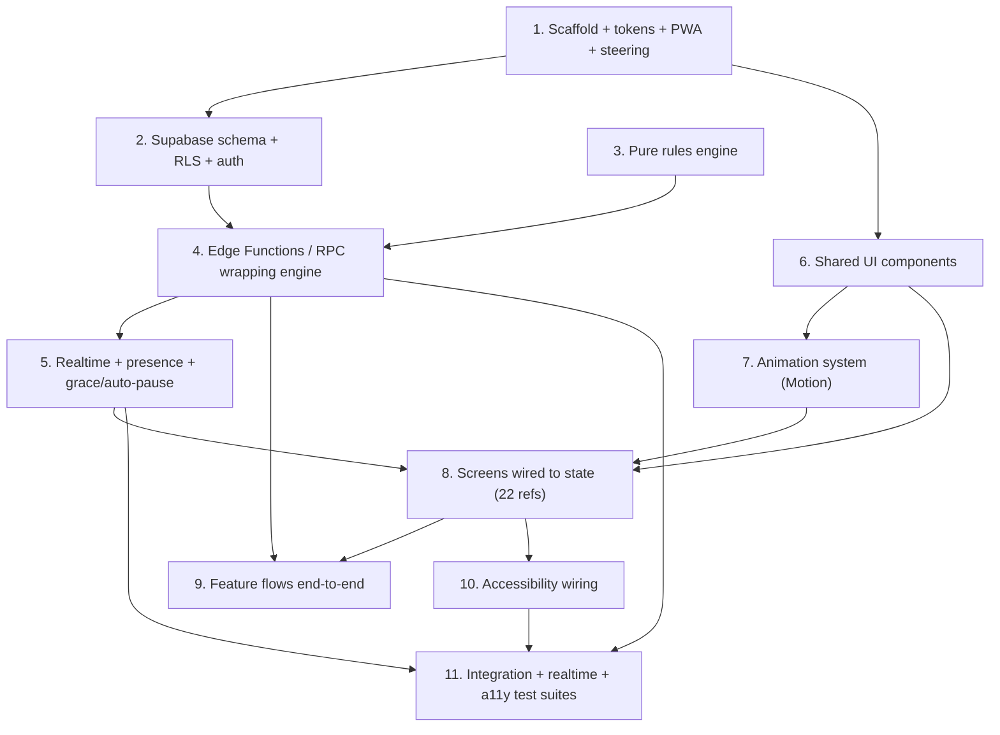

# Implementation Plan: Homemade Uno

## Overview

This plan builds Homemade Uno bottom-up so every step compiles and integrates with the ones before it: first the app scaffold and design-token wiring, then the Supabase backend (schema + RLS), then the pure server-side **rules engine** (the correctness surface), then the Edge Functions/RPC that wrap it, then the realtime/presence layer, then the shared UI components and animation system, then all 22 screens, then the end-to-end feature flows, and finally accessibility wiring.

The system is **server-authoritative**: the rules engine and all game mutations run in Edge Functions; clients only render state and send versioned action requests. Testing is woven throughout — property-based tests (fast-check, ≥100 iterations each) for the 15 correctness properties live next to the engine, unit tests cover engine edge cases, integration tests cover Edge Functions + RLS, and realtime tests cover sync/reconnect windows.

All UI is grounded in the `Design_Spec` (`design/uno-design/design.md`, `screen-map.json`, `theme.css`, `tokens.json`, `screens/`). No invented tokens (Req 20).

## Task Dependency Graph



```json
{
  "waves": [
    { "id": 0, "tasks": ["1.1", "1.6", "3.1"] },
    {
      "id": 1,
      "tasks": ["1.2", "1.3", "1.4", "1.5", "1.7", "3.2", "3.3", "3.5", "3.7"]
    },
    {
      "id": 2,
      "tasks": [
        "2.1",
        "2.2",
        "3.4",
        "3.6",
        "3.8",
        "3.10",
        "3.12",
        "3.13",
        "6.1",
        "6.2",
        "6.3",
        "6.4"
      ]
    },
    {
      "id": 3,
      "tasks": ["2.3", "3.9", "3.11", "3.14", "3.15", "3.17", "7.1", "7.2"]
    },
    { "id": 4, "tasks": ["2.4", "3.16", "4.1"] },
    { "id": 5, "tasks": ["4.2", "4.3", "4.4", "4.5", "4.6", "4.7"] },
    { "id": 6, "tasks": ["4.8", "5.1", "5.2", "5.3", "5.4"] },
    {
      "id": 7,
      "tasks": ["5.5", "8.1", "8.2", "8.3", "8.4", "8.5", "8.6", "8.7"]
    },
    { "id": 8, "tasks": ["9.1", "9.2", "9.3", "9.4", "9.5", "9.6"] },
    { "id": 9, "tasks": ["10.1", "10.2"] },
    { "id": 10, "tasks": ["10.3"] },
    { "id": 11, "tasks": ["11"] }
  ]
}
```

## Tasks

- [x] 1. Scaffold the app, wire design tokens, PWA, and the design steering file
  - [x] 1.1 Initialize the Vite + React + TypeScript project and base folder structure
    - Create the Vite React-TS app; add the `src/` layout from the design's Components and Interfaces section: `main.tsx`, `App.tsx`, `routes/`, `components/`, `game/`, `realtime/`, `supabase/`, `design/`
    - Configure TypeScript strict mode and path aliases; add the React Router provider skeleton in `App.tsx` with routes for home, lobby, game, game-over, settings, how-to-play
    - _Requirements: 20.3_

  - [x] 1.2 Install and wire Tailwind CSS v4 with `theme.css`
    - Add Tailwind v4 and import `design/uno-design/theme.css` once so `@theme`/`@import` exposes token classes (`bg-ink`, `text-suit-red-ink`, `rounded-panel`, `shadow-cta`, `animate-turn-pulse`, `pt-safe`/`pb-safe`)
    - Verify token classes resolve in a throwaway sample and that Tailwind's default spacing scale is available
    - _Requirements: 20.1, 20.2_

  - [x] 1.3 Add the PWA manifest, service worker, and mobile viewport/root shell
    - Create the web manifest with `display: "standalone"`, `orientation: "portrait"`, `background_color: "#F2EBDD"`, `theme_color: "#F2EBDD"`
    - Set viewport meta `width=device-width, initial-scale=1, viewport-fit=cover` and `theme-color` meta `#F2EBDD`; register a service worker in `main.tsx`
    - Size the root with `h-dvh` and apply `pt-safe`/`pb-safe`; add `touch-action: manipulation` on the game table and disable text selection on cards
    - _Requirements: 16.1, 16.2, 16.3, 16.6_

  - [x] 1.4 Add the unsupported-viewport guard
    - Detect viewport width <360px or >430px, or landscape orientation; render the "use a supported portrait phone width" message and suppress game/lobby rendering while the condition holds
    - _Requirements: 16.4, 16.8_

  - [x] 1.5 Create the always-included Design_Steering_File
    - Add a `.kiro/steering/` file with `inclusion: always` that references the Design_Spec (`design/uno-design/` — `theme.css`, `tokens.json`, `screen-map.json`, `screens/`), directs all UI generation to those tokens/theme/screen references, and prohibits inventing tokens
    - _Requirements: 20.1, 20.3 (Development Process)_

  - [x] 1.6 Set up the test runner and fast-check
    - Add Vitest + React Testing Library and the `fast-check` PBT library; add a sample passing test to confirm the harness runs
    - _Requirements: 20.3_

  - [x] 1.7 Set up Playwright for visual UI verification
    - Install `@playwright/test`; run `npx playwright install chromium webkit`
    - Add `playwright.config.ts` pinned to the design viewport (390×844, deviceScaleFactor 2, isMobile, hasTouch) with a WebKit project (targets iPhone Safari) and a Chromium project; configure a `webServer` that runs `npm run dev`
    - Add a reusable capture/compare helper in `e2e/` that navigates to a route/screen state, waits for fonts to load and disables animations (force prefers-reduced-motion), captures a PNG into `e2e/__shots__/<screen-id>.png`, and supports Playwright visual-regression baselines (`toHaveScreenshot`) so a screen can be diffed against a stored baseline; the agent compares each capture against the matching `design/uno-design/screens/<screen-id>.png` reference
    - Note the limitation: screenshot diffing catches layout/visual drift only, not semantic correctness or full WCAG (that stays with task 10.3 automated checks + manual AT testing)
    - _Requirements: 19.1, 20.3_

- [ ] 2. Set up Supabase: config, anonymous auth, schema, and RLS
  - [ ] 2.1 Configure the Supabase client and anonymous auth
    - Add the typed Supabase client in `src/supabase/`; implement anonymous sign-in so the session `auth.uid()` becomes the persisted `Player_ID`; expose a hook that guarantees a session before any room action
    - _Requirements: 2.11, 3.1, 14.6_

  - [ ] 2.2 Write the Postgres schema migrations
    - Create migrations for `rooms`, `players`, `game_state`, `hands`, and `actions` exactly per the Data Models tables (columns, types, PKs, uniqueness `(room_id, player_id)` and `room_code` unique)
    - Store `draw_pile` as a server-only ordered `jsonb` column on `game_state`; include `version`, `phase`, `penalty_count`, `pending_penalty_kind`, `paused_by`, `paused_at`, `pending_choice`, `winner`
    - _Requirements: 14.4, 23.2, 23.3_

  - [ ] 2.3 Write the RLS policies
    - `hands` SELECT allowed only when `player_id = auth.uid()`, plus partner readability in Team mode (same `team`, same room); no cross-team/non-self reads
    - Expose a public `game_state` projection view that excludes `draw_pile`; grant no client SELECT on `draw_pile`; make `players`/`rooms` readable within the room (no hand data)
    - Grant all game-table writes to the service role only (no client INSERT/UPDATE/DELETE on `game_state`, `hands`, `draw_pile`); add a narrow policy letting a caller update only their own `players.last_seen`
    - _Requirements: 13.8, 14.6, 23.1, 23.2, 23.3_

  - [ ]\* 2.4 Write RLS integration tests
    - As player A, assert a SELECT on player B's hand returns no rows (Normal); in Team mode assert a partner's hand is readable and an opponent's is not; assert no client role can read `draw_pile`
    - _Requirements: 14.6, 23.1, 23.2_

- [x] 3. Implement the pure, server-side rules engine (TypeScript module)
  - [x] 3.1 Define engine types, deck build, and shuffle
    - Add `game/engine/` types for `Card { id, suit?, value }`, authoritative `GameState`, actions, and results; implement `buildDeck()` (108 cards) and a Fisher–Yates `shuffle(rng)` taking an injected seeded RNG
    - _Requirements: 5.1_

  - [x]\* 3.2 Property test — deck composition
    - **Property 1: Deck composition** — a freshly built deck is exactly the 108-card multiset
    - fast-check, ≥100 iterations, tagged `Feature: homemade-uno, Property 1`
    - _Requirements: 5.1_ _Properties: 1_

  - [x] 3.3 Implement deal, initial discard, seat/team assignment, and first player
    - Deal 7 cards each round-robin by seat; flip the top card as the initial discard, reshuffling until a number card is on top; set `active_color`; host is first active; `direction = +1`; Team mode alternates seats A/B so partners sit opposite
    - _Requirements: 5.2, 5.3, 5.5, 5.6, 5.7_

  - [x]\* 3.4 Property tests — team seat alternation and card conservation on deal
    - **Property 3: Team seat alternation**; **Property 2: Card conservation** (union of hands + draw + discard = 108, unique ids) checked after dealing
    - fast-check, ≥100 iterations each, tagged `Feature: homemade-uno, Property 3` / `Property 2`
    - _Requirements: 5.2, 5.7_ _Properties: 2, 3_

  - [x] 3.5 Implement turn advancement with reverse and skip (incl. 2-player)
    - Advance `active_seat` by `direction` to the next occupied seat; reverse inverts direction with 3+ players and re-plays the same player with exactly 2; skip advances past the next player with 3+ and re-plays the same player with exactly 2
    - Reject any play/draw from a non-active player leaving state unchanged
    - _Requirements: 6.1, 6.2, 6.3, 6.4, 6.5, 6.9_

  - [x]\* 3.6 Property tests — active player, reverse/skip order, forbidden-context no-ops
    - **Property 4: Exactly one active player**; **Property 5: Reverse turn order**; **Property 6: Skip turn order**; **Property 7: Forbidden-context actions are no-ops**
    - fast-check, ≥100 iterations each, tagged `Feature: homemade-uno, Property 4/5/6/7`
    - _Requirements: 6.1, 6.2, 6.3, 6.4, 6.5, 6.9, 8.5, 10.3, 12.4, 25.6_ _Properties: 4, 5, 6, 7_

  - [x] 3.7 Implement match validity and non-wild play resolution
    - Accept a non-wild card iff suit equals `active_color` or value/symbol equals the discard top; on legal play move it to discard top and set `active_color`; reject illegal plays leaving hand/discard/color/seat unchanged (illegal-tap signal surfaced to client)
    - _Requirements: 7.1, 7.3, 7.4_

  - [x] 3.8 Implement wild play and color selection
    - Playing a wild (no penalty pending) is legal and enters `wild_pending`; a chosen suit sets `active_color`; while pending, keep active player and reject all non-color-choice actions and any dismissal; a winning wild requires the color before the win resolves
    - _Requirements: 7.2, 7.5, 8.1, 8.2, 8.5, 8.6_

  - [x]\* 3.9 Property tests — match legality and wild color
    - **Property 8: Match legality**; **Property 9: Wild selection sets the active color**
    - fast-check, ≥100 iterations each, tagged `Feature: homemade-uno, Property 8/9`
    - _Requirements: 7.1, 7.2, 7.3, 8.2_ _Properties: 8, 9_

  - [x] 3.10 Implement +2 / +4 asymmetric stacking and penalty resolution
    - `+2` adds 2, `wild4` adds 4, each targets the next player; a `+2` stacks only onto a pending `+2`, a `wild4` stacks onto pending `+2` or `+4`, a `+2` onto pending `+4` is rejected (`pending_penalty_kind` tracks the top); a non-stacking response draws `penalty_count`, resets to 0, and advances; a stacked `wild4` lets its player choose the last-applied color after the draw
    - _Requirements: 9.1, 9.2, 9.3, 9.4, 9.5, 9.6_

  - [x]\* 3.11 Property tests — stacking eligibility and penalty clearing
    - **Property 10: Penalty accumulation and asymmetric stacking**; **Property 11: Penalty clears only by drawing**
    - fast-check, ≥100 iterations each, tagged `Feature: homemade-uno, Property 10/11`
    - _Requirements: 9.1, 9.2, 9.3, 9.4, 9.5_ _Properties: 10, 11_

  - [x] 3.12 Implement draw-one, reshuffle-on-empty, and end-turn-without-draw
    - With no penalty and nothing drawn, draw exactly one card and set `drew_this_turn`; return a play/keep decision if playable, else keep and advance; reject a second draw; reshuffle discards (except top) into the draw pile when empty and ≥2 discards exist; if only the top remains, complete the turn without drawing and advance
    - _Requirements: 10.1, 10.3, 10.4, 10.5, 10.7, 10.8_

  - [x] 3.13 Implement last-card call, penalty, and flag hygiene
    - Enable "LAST CARD!" only on the player's turn holding exactly 2 cards; record the call for the turn; if a turn ends holding 1 card with no call, draw 2; clear the call when a hand grows above 1 card
    - _Requirements: 11.1, 11.2, 11.3, 11.4_

  - [x]\* 3.14 Property tests — last-card penalty and flag hygiene
    - **Property 12: Last-card penalty**; **Property 13: Last-card flag hygiene**
    - fast-check, ≥100 iterations each, tagged `Feature: homemade-uno, Property 12/13`
    - _Requirements: 11.3, 11.4_ _Properties: 12, 13_

  - [x] 3.15 Implement win detection and auto-pause predicate
    - End the game when an in-game hand reaches 0 via a legal final play (Normal → that player; Team → that team); reject actions after end; compute the auto-pause predicate (fewer than 2 connected, or a whole team disconnected in Team mode)
    - _Requirements: 12.1, 12.2, 12.4, 15.7, 25.10_

  - [x]\* 3.16 Property tests — win detection and auto-pause predicate
    - **Property 14: Win detection**; **Property 15: Auto-pause predicate**
    - fast-check, ≥100 iterations each, tagged `Feature: homemade-uno, Property 14/15`
    - _Requirements: 12.1, 12.2, 15.7, 25.10_ _Properties: 14, 15_

  - [x]\* 3.17 Unit tests — engine examples and edge cases
    - Reverse and skip in the exact-2-player case; initial-discard reshuffle when the flipped card is an action card; `+2` onto pending `+4` rejected and `wild4` onto `+2` accepted; reshuffle-on-empty vs. no-draw (only top); last-card penalty on ending a turn at 1 card without calling; winning wild requires color before the win resolves
    - _Requirements: 5.5, 6.3, 6.5, 8.6, 9.5, 10.7, 10.8, 11.3_

- [ ] 4. Wrap the engine in Edge Functions / RPC (server-authoritative, versioned)
  - [ ] 4.1 Add the shared action harness: version check, persist-before-confirm, action log
    - Implement a service-role helper that row-locks `game_state`, rejects when `based_on_version != version` or the caller is not the active player, applies the engine transition, increments `version`, writes `game_state`/`hands` in one transaction before returning accept, and appends to `actions`
    - _Requirements: 14.4, 14.5_

  - [ ] 4.2 Implement `create_room` and `join`
    - `create_room`: generate a unique 4-char code (A–Z/0–9 minus `0 O 1 I L`, retry ≤10, abort on failure), insert room (Normal, `lobby`) + host player with `join_order`, return room + invite link
    - `join`: validate room exists (else not-found), enforce max 8 players (else room-full), duplicate-name suffixing; deny non-members when the game has started; restore an existing member to their seat/hand on rejoin
    - _Requirements: 1.1, 1.9, 1.10, 1.11, 1.13, 2.3, 2.6, 2.10, 3.2, 3.4, 24.1_

  - [ ] 4.3 Implement `start_game`
    - Validate mode constraints (Normal ≥2, Team exactly 4); assign seats (team-alternating in 2v2), deal via the engine, set phase `playing`, host first active, direction clockwise; persist and broadcast
    - _Requirements: 4.7, 4.8, 5.2, 5.6, 5.7_

  - [ ] 4.4 Implement `play_card`, `choose_color`, `draw_one`, and `keep`
    - Route each through the harness into the engine (play/validate, wild color set, single draw with reshuffle, keep ends turn); return accept with new public state and the caller's hand, or reject with a reason code
    - _Requirements: 7.1, 7.2, 7.3, 8.1, 8.2, 9.x, 10.1, 10.2, 10.3, 10.4, 10.5, 14.5_

  - [ ] 4.5 Implement `call_last`, `end_game`, and `leave`
    - `call_last`: record the call when eligible; `end_game`: end with no winner (Auto_Pause "End game"); `leave`: mark the player left/disconnected, skip their turns immediately with no grace, apply continue-without behavior, and trigger auto-pause if the predicate holds
    - _Requirements: 11.1, 11.2, 22.2, 22.3, 25.13_

  - [ ] 4.6 Implement `pause`, `resume`, and `continue_without`
    - `pause`: set `paused`, `paused_by`, `paused_at`; reject all play/draw/call/color/skip while paused and stop the grace countdown; `resume`: return to active and re-show any `pending_choice` to the same player; `continue_without`: resume and skip the disconnected player (drawing pending penalty if their turn), skipping later turns immediately
    - _Requirements: 25.1, 25.6, 25.7, 25.9, 25.14_

  - [ ] 4.7 Implement host succession and round increment on game end / play-again
    - On host leave/disconnect at lobby or game end, pass host to the longest-present connected player; on "Play again" return everyone to the lobby with the same mode/teams and increment `round_number`
    - _Requirements: 3.6, 12.5, 12.6, 12.7, 15.8_

  - [ ]\* 4.8 Integration tests — server authority
    - Call `play_card` as a non-active player and with a stale version; assert both reject and state is unchanged; assert state is committed before the accept response
    - _Requirements: 14.4, 14.5_

- [ ] 5. Build the realtime client layer, presence, and grace/auto-pause mechanics
  - [ ] 5.1 Implement channel subscription and the authoritative store
    - In `src/realtime/`, subscribe to `game_state` (public projection), `players`, and own/partner `hands` rows; hold server state read-only in a store (Zustand or context+reducer); the action client stamps each request with the current `version` and reverts optimistic UI on rejection
    - _Requirements: 14.1, 14.2, 14.3, 14.5, 14.6_

  - [ ] 5.2 Implement presence, connection state, and the server-enforced heartbeat
    - Track `player_id` in channel presence; flip `connection_state` on join/leave; periodically update only the caller's own `players.last_seen`; the server compares `now() - last_seen` against the 60s Grace_Period before any skip
    - _Requirements: 15.1, 15.6_

  - [ ] 5.3 Implement reconnect resync
    - On reconnect, re-subscribe and load the current authoritative public state and the caller's own hand within 5s; restore seat/hand per Requirement 3
    - _Requirements: 3.2, 14.7, 15.2, 15.4_

  - [ ] 5.4 Implement grace-period auto-skip and auto-pause/auto-resume
    - When it becomes a disconnected active player's turn, run the 60s countdown; skip and draw pending penalty when elapsed and not paused; skip later turns immediately; start Auto_Pause when the predicate holds and auto-resume when the condition clears
    - _Requirements: 15.3, 15.5, 15.7, 25.8, 25.10, 25.12_

  - [ ]\* 5.5 Realtime sync tests
    - Two subscribed clients receive new public state within 2s of an accepted action; lobby membership/mode/host changes propagate within 2s; a reconnecting client receives public state + own hand within 5s; presence disconnect drives server-enforced grace/skip and auto-pause
    - _Requirements: 14.1, 14.2, 14.3, 14.7, 15.3, 25.10_

- [ ] 6. Build shared UI components grounded in Design_Spec tokens
  - [ ] 6.1 Implement card and avatar primitives
    - `PlayingCard` (§5.1) with distinct suit shapes at all sizes, `CardBack` (§5.2), `Avatar` (§5.3) with card-count badge and turn pulse
    - _Requirements: 13.5, 18.3, 20.1, 20.3_

  - [ ] 6.2 Implement buttons, chips, inputs, and switch
    - Buttons (§5.4 incl. disabled primary), `Chip`/`TurnPill` (§5.5), `Input`/`InputError` (§5.6, §5.21), `Switch` (§5.7), `InfoNote` (§5.22)
    - _Requirements: 20.1, 20.3_

  - [ ] 6.3 Implement lobby structural components
    - `TeamCard`/`PlayerRow` (§5.8, §5.11), `ModeControl` segmented (§5.9), `EmptySlot` (§5.12), `DragHandle` + drag states (lifted/tilted row, drop target, dashed placeholder) (§5.13), `StartControl` (§5.14)
    - _Requirements: 20.1, 20.3, 21.1_

  - [ ] 6.4 Implement overlay and result components
    - `MenuDrawer` (§5.10), `BottomSheet` (§5.15), `WildColorButtons` (§5.16), `SpotlightCard` (§5.17), `Dialog` (§5.18), `Toast` (§5.19), `OfflineAvatar` + `CountdownRing` (§5.20), `Confetti` (§5.25), `PausedOverlay` (§11/§12)
    - _Requirements: 20.1, 20.3_

- [ ] 7. Build the animation system with Motion for React
  - [ ] 7.1 Implement card-flight and turn animations
    - Shared `layoutId={card.id}` play/throw (spring 380/30, random −10°…+10°); opponent card flight + `rotateY 180→0` flip; draw slide-and-flip; deal stagger (60ms round-robin); select raise; illegal-tap shake; turn-pill cross-fade + turn pulse; wild color-change ring/glow cross-fade
    - Handle interrupted shared transitions by committing the card to the final discard position
    - _Requirements: 5.4, 7.3, 8.3, 10.6, 17.1, 17.2, 17.3, 17.4, 17.7_

  - [ ] 7.2 Implement overlay/drag/pause animations and reduced-motion handling
    - Menu drawer slide + backdrop fade; bottom sheet slide-up + spotlight scale; dialog fade/scale; toast slide+fade; drag lift/tilt + drop spring; pause overlay fade; countdown ring drain; confetti burst
    - Add a `prefers-reduced-motion` hook that swaps flights for instant moves, removes the turn pulse, and renders confetti statically
    - _Requirements: 17.5, 17.6, 17.8, 17.9, 17.10_

- [ ] 8. Wire screens to state (all 22 screen references)
  - [ ] 8.1 Build the Home route and its states (`01-home`, `01b`, `01c`)
    - Hero card-fan, name input, "Create a room", join code input with uppercase-only 4-char entry and "Join", "How to play" link, settings button; pre-fill code from invite link; render room-not-found (`01b`), room-full, and game-already-started (`01c`) states
    - Capture each screen state built here (`01-home`, `01b-home-room-not-found`, `01c-game-already-started`) at 390×844 with the Playwright helper and compare against the corresponding `design/uno-design/screens/<screen-id>.png` references
    - _Requirements: 1.1, 1.2, 2.1, 2.2, 2.3, 2.4, 2.5, 2.6, 2.7, 2.10, 3.5, 16.5, 19.1_

  - [ ] 8.2 Build Settings (`01d`) and How to play (`01e`)
    - Editable name (1–16 chars, stored on device), Sound/Vibration/Highlight switches with Vibration hidden when unsupported, "How to play" link, app version; scrolling rules page with all sections
    - Capture each screen state built here (`01d-settings`, `01e-how-to-play`) at 390×844 with the Playwright helper and compare against the corresponding `design/uno-design/screens/<screen-id>.png` references
    - _Requirements: 1.7, 1.12, 16.5, 16.7, 19.1_

  - [ ] 8.3 Build the Lobby route and all six states (`02a`–`02f`)
    - Room-code panel (Copy link / Share invite), ModeControl (host-editable, guest read-only "chosen by the host"), player list / team cards with empty slots, StartControl with the exact disabled messages; host vs. guest views; render `02a` just-created, `02b` normal (2v2 disabled + note), `02c` waiting, `02d` ready, `02e` dragging, `02f` guest
    - Capture each screen state built here (`02a-lobby-just-created`, `02b-lobby-normal`, `02c-lobby-2v2-waiting`, `02d-lobby-2v2-ready`, `02e-lobby-dragging`, `02f-lobby-guest`) at 390×844 with the Playwright helper and compare against the corresponding `design/uno-design/screens/<screen-id>.png` references
    - _Requirements: 4.1, 4.2, 4.3, 4.4, 4.5, 4.7, 4.8, 4.9, 4.12, 21.1, 21.7, 19.1_

  - [ ] 8.4 Build the Game table (`03-game-2v2`, `04-game-normal`)
    - `GameTable` with draw/discard piles, direction ring, turn pill, own avatar + "LAST CARD!" button, fanned hand with unplayable-card dimming (when Highlight enabled) and selected-card raise; partner hand face-up (2v2, partner 3D recipe), opponent seats as face-down backs (≤7 shown) with real count badges; turn ring color per mode; "Round N" mode chip
    - Capture each screen state built here (`03-game-2v2`, `04-game-normal`) at 390×844 with the Playwright helper and compare against the corresponding `design/uno-design/screens/<screen-id>.png` references
    - _Requirements: 5.6, 6.4, 6.5, 6.6, 6.7, 7.5, 7.6, 11.1, 12.6, 13.1, 13.2, 13.3, 13.4, 13.5, 19.1_

  - [ ] 8.5 Build the in-game overlays (`05`, `06a`–`06d`)
    - Menu drawer (room code + Copy link, cards-left per player grouped by team, three switches, Pause game, How to play, Leave game); wild color picker bottom sheet (no cancel); drew-a-card sheet (Play it / Keep it); player-disconnected table state (offline avatar + countdown ring + toast + "Pause and wait"); leave-confirm dialog
    - Capture each screen state built here (`05-menu`, `06a-wild-color-picker`, `06b-drew-playable-card`, `06c-player-disconnected`, `06d-leave-confirm`) at 390×844 with the Playwright helper and compare against the corresponding `design/uno-design/screens/<screen-id>.png` references
    - _Requirements: 1.3, 8.1, 8.2, 9.6, 10.2, 15.1, 15.3, 15.5, 22.1, 25.1, 25.2, 19.1_

  - [ ] 8.6 Build Game over (`07`) and its variants
    - Result screen with confetti, winner avatars, result title, last-card-player, remaining counts per player; host "Play again" vs. guest "Waiting for the host"; "Back to home"; variants for Normal winner, guest view, and "Game ended" (no winner, no confetti)
    - Capture each screen state built here (`07-game-over` and its variants) at 390×844 with the Playwright helper and compare against the corresponding `design/uno-design/screens/<screen-id>.png` references
    - _Requirements: 12.1, 12.2, 12.3, 12.4, 12.5, 25.13, 19.1_

  - [ ] 8.7 Build the paused overlays (`08a`–`08c`)
    - Break variant (`08a`: "Game paused", who paused, "Paused for m:ss", "Resume game"); Waiting variant (`08b`: "Waiting for [name]", offline avatar, "Continue without [name]"); Auto variant (`08c`: team/players offline, "End game"); menu stays available while paused
    - Capture each screen state built here (`08a-paused`, `08b-paused-waiting`, `08c-paused-team-offline`) at 390×844 with the Playwright helper and compare against the corresponding `design/uno-design/screens/<screen-id>.png` references
    - _Requirements: 25.3, 25.4, 25.5, 25.7, 25.8, 25.9, 25.10, 25.11, 25.13, 25.15, 19.1_

- [ ] 9. Wire the end-to-end feature flows
  - [ ] 9.1 Wire create / join / rejoin flows
    - Home → `create_room` → Lobby; invite-link open with/without stored name; join by code; copy-link confirmation and clipboard-failure fallback; native share with clipboard fallback; rejoin restores seat/hand; return an in-progress member to their game on launch
    - _Requirements: 1.3, 1.4, 1.5, 1.6, 1.7, 2.8, 2.9, 3.2, 3.3_

  - [ ] 9.2 Wire lobby mode selection and real-time team drag-and-drop
    - Host mode switch with join-order team fill (alternating A/B); 2v2 disable/enable and auto-switch-to-Normal toast at 5+ players; drag to swap/move with return-on-invalid-drop; tap/keyboard alternative that moves/swaps a player; reject team changes from non-hosts; propagate mode/team/host/list changes in real time
    - _Requirements: 4.6, 4.9, 4.10, 4.11, 4.13, 21.2, 21.3, 21.4, 21.5, 21.6, 21.7_

  - [ ] 9.3 Wire start + deal into the table
    - Host Start (enabled only when constraints met) triggers `start_game`; render the staggered deal into the table and transition guests into `03`/`04`
    - _Requirements: 5.2, 5.3, 5.4_

  - [ ] 9.4 Wire play / draw / wild / stacking / last-card into the table
    - Card tap → `play_card` with illegal-tap shake on reject; wild → picker → `choose_color`; draw pile → `draw_one` → play/keep sheet; stacking prompts and toasts; "LAST CARD!" enable/record and forgot-to-call penalty toast; turn/penalty/skip/reverse toasts
    - _Requirements: 6.10, 7.3, 8.3, 8.4, 9.x, 10.1, 10.2, 10.6, 11.1, 11.2, 11.3_

  - [ ] 9.5 Wire win, play-again, and host transfer
    - On win, show `07` to all with counts; host "Play again" returns everyone to the lobby with the same mode/teams and bumps the round; guests wait; "Back to home"; host transfer if host gone at end
    - _Requirements: 12.1, 12.2, 12.3, 12.4, 12.5, 12.6, 12.7_

  - [ ] 9.6 Wire disconnect / grace / skip and pause / resume / auto-pause / continue-without / end-game / leaving
    - Offline badge + toast; grace countdown in avatar and pill; "Pause and wait"; manual pause/resume; auto-pause + auto-resume; continue-without; end-game from auto-pause; leave-confirm → return home, immediate skip, rejoin via link
    - _Requirements: 15.1, 15.3, 15.5, 15.8, 22.1, 22.2, 22.3, 25.1, 25.2, 25.7, 25.8, 25.9, 25.11, 25.12, 25.13, 25.14, 25.15_

- [ ] 10. Wire accessibility across the app
  - [ ] 10.1 Native semantics, labels, and live announcements
    - Use native `<button>`/`<input>`/`<a>`; `aria-label` on every icon-only button; card `aria-label` in the "<Suit> <Value>" / wild-name pattern; announce turn changes and card plays in an `aria-live="polite"` region without dropping the latest turn/card announcement
    - _Requirements: 18.1, 18.2, 18.4, 18.7_

  - [ ] 10.2 Focus management, keyboard operability, and drag alternatives
    - Move focus into dialogs/sheets on open and return it on close; close with Escape except the wild picker and the paused overlay; keyboard operability with visible focus for all controls including the drag-handle tap/keyboard alternative
    - _Requirements: 18.6, 18.8, 18.9, 18.10, 21.6_

  - [ ]\* 10.3 Automated accessibility checks
    - Add automated checks for roles, icon-button `aria-label`s, live-region wiring, focus management, and contrast tokens; add a note that full WCAG conformance requires manual testing with assistive technologies and expert review
    - _Requirements: 18.1, 18.4, 18.5, 18.6, 18.9_

- [ ] 11. Checkpoint — full test suite green
  - Ensure all property, unit, integration, realtime, and accessibility tests pass. Ensure all tests pass, ask the user if questions arise.
  - _Requirements: 14.x, 23.x, 18.x_

## Notes

- Tasks marked with `*` are optional (all test sub-tasks) and can be skipped for a faster MVP; core implementation tasks are never optional.
- Each task references specific requirement criteria for traceability; property-test tasks additionally cite the property number they implement via `_Properties: N_`.
- Property-based tests target the pure rules engine (Properties 1–15), each running ≥100 fast-check iterations and tagged `Feature: homemade-uno, Property N`.
- Realtime delivery, RLS-enforced hidden hands, presence-driven grace/skip, PWA/animation, and accessibility are verified with integration, realtime, component, and manual tests rather than as properties.
- Full WCAG conformance requires manual testing with assistive technologies and expert accessibility review; automated checks cover only the mechanics.
- Playwright visual checks (task 1.7 + the per-screen sub-bullets under task 8) render each screen at the 390×844 design viewport and compare against the `design/uno-design/screens/*.png` references; they catch visual/layout drift only — semantic and accessibility correctness stays with tasks 10.x and manual testing.
- All UI is grounded in the Design_Spec tokens/screens; no invented tokens (Req 20), enforced by the always-included Design_Steering_File.
